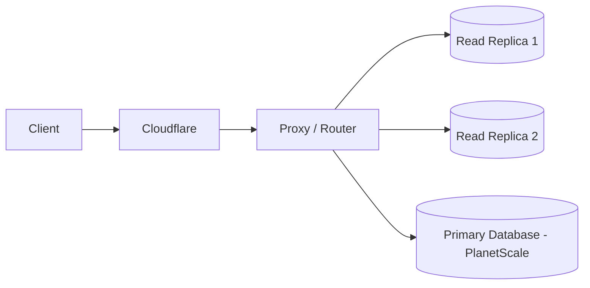
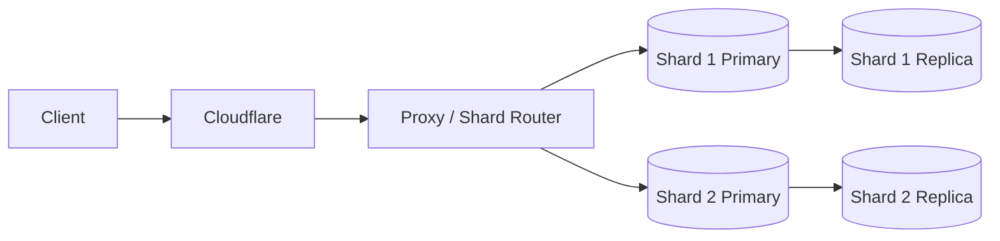

# Database Scaling: Replication and Sharding

This topic introduces a practical scaling path for databases:

1. Start with a primary database and read replicas.
2. Later, when data and traffic get large enough, split into shards.
3. Keep replicas per shard for read scale and high availability.

## Stage 1: Replication (before sharding)

A common setup is:

- client traffic at the edge
- request routing layer
- one or more read replicas
- primary data system (for writes)

### Why this helps

- Better read throughput by distributing reads.
- Lower pressure on the primary write path.
- Easier horizontal growth for read-heavy workloads.

## When sharding usually appears

At some point (often when data size and traffic both grow significantly, for example into multi-terabyte ranges), a single logical database topology can become the bottleneck.

That is where **sharding** becomes relevant.

## Stage 2: Sharding + replicas

**Shard** means an independent database partition.  
Each shard owns only part of the overall dataset.

Each shard can still have replicas:

## Reliability benefit

With a single database node, one outage can impact everyone.

With sharding, failure blast radius is reduced:

- if one shard is degraded, only users/data on that shard are impacted
- users on other healthy shards can continue to operate

This is one of the major operational benefits of sharded systems.

## Backup and restore benefit

With one very large database node, backup/restore speed is bounded by what that single node and pipeline can process.

With sharding, backup and restore jobs can run **in parallel across shards**:

- shard 1 backup runs at the same time as shard 2, shard 3, and so on
- total backup window can be reduced compared to one massive serialized backup
- restore operations can also be parallelized, improving recovery time objectives

## Primary failure and leader election in a shard

In each shard, one node is primary (leader) for writes and others are replicas.

If the primary goes down, the system must promote a replica to become the new primary.

### Why write acknowledgment policy matters

Replica election safety depends on what writes were acknowledged before failure:

- If writes are acknowledged only after strong replication (for example, quorum-style acknowledgement), multiple replicas are likely to have the latest data, and failover is simpler.
- If writes are acknowledged early (before enough replicas catch up), replicas may diverge in freshness, and promoting the wrong replica can lose recently acknowledged writes.

### Practical failover rule

When lag exists, promote the **most up-to-date replica** (highest durable log position), not an arbitrary one.

Operationally, teams usually automate this with:

- replication lag metrics
- durability/log position checks
- fencing to prevent split-brain during promotion
- controlled failover runbooks

## When to shard (and when not to)

Sharding is powerful, but it is usually a **later-stage scaling move**, not an early default.

Typical signs that it is time:

- single-primary vertical scaling is no longer enough
- replica-based read scaling no longer solves the bottleneck
- data size and operational windows (backup, maintenance, recovery) are too large for one logical node
- partitioning boundaries (tenant, region, account range) are clear enough to shard safely

Reasons to avoid premature sharding:

- higher operational complexity (routing, rebalancing, failover, observability)
- harder cross-shard queries and transactions
- tougher incident response and on-call burden

## Opinion: should individual engineers do this at home?

Usually, no. Building production-grade sharding and failover stacks solo is rarely worth it for most personal projects.

A better path:

- learn the concepts deeply (replication lag, quorum, leader election, blast radius)
- run small simulations or toy labs
- rely on managed data platforms for real workloads
- shard only when measurable bottlenecks justify the added complexity

In short: sharding is an important skill to understand, but often a last resort to operate.

## Practical answer: when should *you* shard?

Use this sequence:

1. **Understand the principles now.**
2. **Delay sharding until metrics prove single-cluster scaling is exhausted.**
3. **Shard only for sustained bottlenecks, not occasional spikes.**

### Important nuance about RAM vs total data size

A common statement is "if data no longer fits in RAM, shard."  
That is incomplete.

What matters more is **working set**, not total historical data size:

- If hot data (frequently accessed data + key indexes) fits well enough in memory, large cold data can still be manageable.
- If hot data misses memory often and causes heavy disk IO/latency, pressure rises quickly even before extreme total size.

So "multi-TB dataset" is a warning sign, but not by itself a hard trigger.

## Sharding indicators (the real trigger set)

Treat sharding as justified when several of these are true **at the same time** for a sustained period:

- p95/p99 query latency and timeout rates stay high after query/index tuning
- primary write node is near CPU/IO/connection limits for long windows
- adding read replicas no longer solves user-visible performance issues
- maintenance windows (backup, restore, schema migrations) are too slow for SLOs
- failover risk is high because a single primary remains a major bottleneck
- vertical scaling gets expensive with diminishing performance return
- natural partition boundaries already exist (tenant, region, account range)

### Anti-pattern: "size-only" decisions

Do not shard only because:

- "we crossed 1 TB"
- "someone said 100 GB RAM is the limit"
- "it sounds like senior architecture"

Do shard when bottlenecks are measurable, repeatable, and no longer fixable with simpler steps.

## A practical escalation path before sharding

1. Query tuning and correct indexing
2. Caching and read replicas
3. Data lifecycle controls (archival/retention for cold data)
4. Vertical scaling and storage/IO improvements
5. Operational tuning (backup strategy, failover automation)
6. **Then** sharding, if limits still persist

This reduces complexity cost and helps ensure sharding is done for the right reason.

## Home-lab guidance (revised)

Home labs are still useful, but scope them correctly:

- good for learning concepts, failure drills, and trade-off intuition
- not necessary to recreate full production-grade distributed database operations solo
- focus on decision-making skills: *how to detect the sharding moment from metrics*

## Measurable indicators you can trust (industry-style)

There is no single universal "shard now" number.  
In practice, teams use **SLO-driven indicators** and shard when multiple indicators are red for sustained periods.

### 1) User-facing latency and reliability (primary signal)

Track by critical query and endpoint:

- p95 and p99 read/write latency
- timeout rate
- error rate

Common escalation pattern:

- after indexing/query tuning, p95/p99 stays above SLO for days/weeks
- incidents keep recurring during peak traffic

If this is persistent, it is a strong "single topology is strained" signal.

### 2) Primary node saturation (capacity signal)

Track sustained utilization, not short spikes:

- CPU utilization
- disk IO/IOPS saturation
- storage throughput saturation
- connection pool exhaustion / queue depth

Rule of thumb used in many ops teams:

- frequent sustained high utilization (for example, long windows above ~70-80% on core bottleneck resources) despite optimization and scaling attempts

### 3) Replica effectiveness (scale-out signal)

Replicas help until they do not.

Track:

- read replica lag
- read offload percentage
- read latency improvement after adding replicas

Sharding becomes more likely when:

- adding replicas no longer materially improves p95/p99 or stability
- lag grows under peak traffic and read consistency expectations are missed

### 4) Working set pressure (memory/IO signal)

Track:

- buffer cache hit ratio
- page faults / disk read amplification
- hot index residency behavior

Interpretation:

- if hot working set no longer fits effectively in memory, tail latency climbs and IO pressure rises
- this is often more meaningful than total TB size alone

### 5) Operational window violations (operability signal)

Track operations against SLO/SLA targets:

- backup duration
- restore duration (RTO)
- recovery point gap (RPO)
- schema migration / maintenance window duration

If these repeatedly exceed allowed windows, sharding (or major repartitioning) moves higher priority.

### 6) Failover and blast-radius risk (resilience signal)

Track:

- failover time
- failover success rate
- user impact scope per incident

If one primary failure still causes broad impact and recovery is slow, partitioning/sharding can reduce systemic risk.

## A practical decision rule

Use a "3 of 6 sustained" policy:

- if at least 3 indicator groups above are red for a sustained period (for example 2-4 weeks),
- and simpler mitigations are exhausted,
- then start sharding design work.

This avoids both premature sharding and late reactive sharding.

## Suggested dashboard starter

For each critical service/domain, create one view with:

- p95/p99 latency + timeout/error rates
- primary CPU/IO/connections
- replica lag + read offload
- cache hit ratio / memory pressure
- backup/restore duration trend
- failover duration + incident impact trend

Once this dashboard is in place, "when to shard" becomes a data conversation, not a guess.

## Benchmarking strategy (single-node baseline -> shard decision)

Yes, this is a strong and practical method.

You usually cannot predict the exact sharding moment from theory alone.  
So build a quantitative baseline first, then compare growth against it.

### Step 1: Establish a single-node baseline

Measure your current topology (primary + replicas if present) under representative load:

- mixed workload profile (for example 70% reads / 30% writes, or your real ratio)
- realistic query mix (top N real endpoints/queries, not synthetic-only)
- realistic dataset shape (hot vs cold data distribution)

Capture at minimum:

- throughput (QPS/TPS)
- p50/p95/p99 latency
- timeout/error rate
- CPU, memory, disk IO, connection usage
- replica lag (if using replicas)

This baseline becomes your reference point.

### Step 2: Run a workload ramp test

Increase load in steps (for example +10-20% per step) and observe where behavior bends:

- latency inflection points (tail latency climbs sharply)
- error/timeout acceleration
- saturation of one bottleneck resource (CPU, IO, or connections)

The first stable inflection is your "capacity knee."

### Step 3: Project headroom

Compare current production peak vs tested knee:

- if peak is close to the knee, risk is rising
- if projected growth reaches knee soon, plan scaling changes now

Many teams use a safety margin policy (for example, keep normal peak well below tested knee) to avoid emergency migrations.

### Step 4: Re-test after each optimization tier

Before sharding, re-benchmark after:

- indexing/query rewrites
- caching
- replica additions
- vertical scaling

If each tier yields smaller and smaller gains while SLO risk remains, sharding becomes justifiable.

## What benchmark data can and cannot do

Benchmarking gives you:

- quantitative comparison instead of guesswork
- early warning and planning time
- a defensible narrative for "why now"

Benchmarking does not give:

- one universal shard threshold that applies to every app
- a guarantee unless workload realism is good

So the best practice is:

- **benchmark + production telemetry + SLOs** together,
- not benchmark numbers alone.

## Notes for this playground topic

This is an evolving topic folder. Next additions can include:

- shard key design
- hot shard detection
- resharding strategies
- cross-shard query and transaction trade-offs
